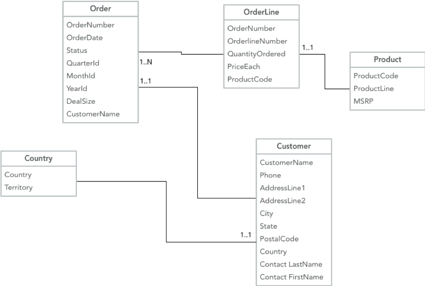

# Overview

This demo shows how to enrich event stream data generated from a group of related business objects (in a typical Third Normal Form as used in Data Warehouses) and then stream into Google BigQuery (a tabular database).

The data model is a 3NF representation of Sales Data from [Kaggle](https://www.kaggle.com/kyanyoga/sample-sales-data) 

Each table in the schema may be event-enabled (using Change Data Capture, or by simply polling using JDBC), so we get 5 individual topics containing all changes to each of the 5 related objects. In order to pass this data to a typical Cloud Big Data system (in this example Google BigQuery) we need to flatten the data, enriching all the references.

## Join using KSQL

[Confluent KSQL](https://www.confluent.io/product/ksql/) provides a simple SQL-based environment to create streaming applications by means of pair-wise joins. We can use it to enrich the events coming from the Sales Data source.

You may follow the [step-by-step guide](dwh2cloud.adoc), which is based on Docker (instead of your local Confluent Platform install).
